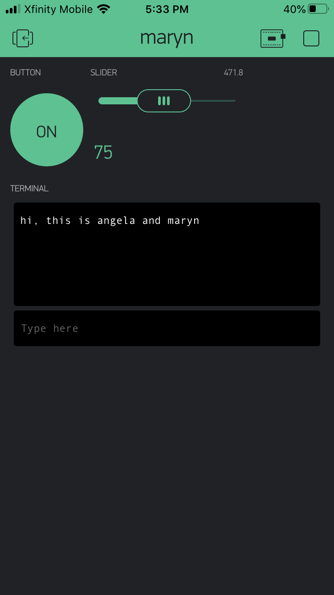

Name:Angela Chan

EID:ac74772

Team Number:15

## Questions

1. What is the purpose of an IP address?

    An IP address gives an identification to the each machine that is connected to the network or internet.

2. What is a DNS? What are the benefits of using domain names instead of IP addresses?

    DNS, the Domain Name Service, gives and maps a symbolic name to each IP address. The benefit of this would be for each identification and memorization. 

3. What is the difference between a static IP and a dynamic IP?

    A static IP are addresses that do not change, and dynamic IP are addresses that are assigned by the network.

4. What is the tradeoff between UDP and TCP protocols?

    TCP gives guaranteed communication, but is slower than UDP which provides unreliable best-effort (fast) communication.

5. Why can't we use the delay function with Blynk?

    You can't use a delay function with Blynk because Blynk is event-based (if the pin needs info or writes info) delay mess up the timing.

6. What does it mean for a function to be "Blocking"?

    This means that nothing else can run while the function is running. 

7. Why are interrupts useful for writing Non-Blocking code?

    Because it is effective (don't waste time).

8. What is the difference between interface and implementation? Why is it important?

   Interface defines the instructions that may be used (how a function is called) and the implementation is the definition of the functions that will be used.

9. Screenshot of your Blynk App:

    
